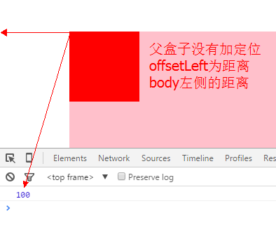
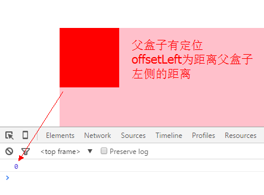
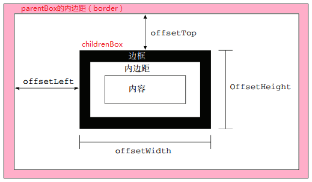
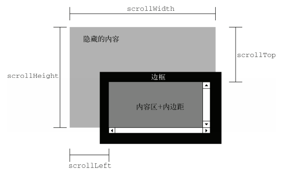

# client和event

- `clientHeight`：表示的是可视区域的高度，`不包含border和滚动条`
- `offsetHeight`：表示可视区域的高度，包含了`border和滚动条`
- `scrollHeight`：表示了所有区域的高度，包含了因为滚动被隐藏的部分
- `clientTop`：表示边框border的厚度，在未指定的情况下一般为0
- `scrollTop`：滚动后被隐藏的高度，获取对象相对于由offsetParent属性指定的父坐标(css定位的元素或body元素)距离顶端的高度

## offsetHeight和offsetWidth

- offsetHeight和style.height的区别: `style.height是字符串,offsetHeight是数值`
- `demo.style.height`是用来获取和设置行内样式的,`offsetHeight`是只读属性
- `demo.style.height`只能获取和设置行内样式,如果样式写到了其他地方,甚至根本就没写,便无法获取.因此,工作中一般用`demo.offsetHeight`来获取某元素的真实宽度/高度,用`style.height`来设置宽度/高度
- `offsetHeight`的构成`offsetHeight = height+padding+border`,`包括 自身高度 内边距 边框 不包括 外边距`

## offsetLeft和offsetTop

- `offsetLeft`和`style.left`的区别:
  - 最大区别在于`offsetLeft`可以计算没有定位的盒子到左侧的距离,而`style.left`可能会出问题
  - 如果没有给 HTML 元素指定 left样式,则`style.left`返回的是空字符串.
  - `offsetLeft`只读,而`style.left`可读写.
  - `offsetLeft`返回的是数字,而`style.left`返回的是字符串,除了数字外还带有单位：`px`.
- `offsetLeft`的构成:
  - 到最近的（带有定位的）父元素的 左侧/顶部 的距离
  - 如果所有父级都没有定位则以body 为准
  - `offsetLeft` 是到父亲的`padding`左侧的距离（不是`border`更不是`margin`）





## offsetParent

- `offsetParent`:返回该对象带有定位的父级
- 如果当前元素的所有父级元素都没有定位`（position为absolute或relative）`,`offsetParent`为`body`
- 如果当前元素的父级元素中有定位`（position为absolute或relative）`,`offsetParent`取最近的那个父级元素
- 另外注意`offsetParent`与`parentNode`的区别`parentNode`只找自己的上一级元素

## scrollHeight

- `window.onscroll = function () { 语句 }`
- 页面滚动座标: `window.scrollTo(xpos,ypos)`窗体（左上角）滚动到页面这个座标`position`
- `scrollHeight`和`scrollWidth: content+padding` 对象内部实际内容的高度/宽度
- `scrollTop`和`scrollLeft` 被卷去部分的 `顶部/左侧` 到可视区域 `顶部/左侧` 的距离

- `兼容写法：`

```js
// 正常浏览器（除了ie678之外的浏览器）
window.pageYOffset
// 已经声明DTD（标准模式）
document.documentElement.scrollTop
// 未声明 DTD（怪异模式）
document.body.scrollTop

scrollTop = window.pageYOffset || document.documentElement.scrollTop || document.body.scrollTop || 0;
```



## 样式获取

- 访问属性的两种方式: `div.style.width`, 只能得到行内样式
- 另外一种写法: `div.style["width"]` 引号内写属性的名字
- 计算后样式的获取:

```js
// IE678:
// element.currentStyle.属性名 或 element.currentStyle["属性名"]
demo.currentStyle.left
demo.currentStyle["left"]

// w3c:
//window.getComputedStyle(element,伪元素)["属性名"]
// 一般情况下没有伪元素,我们用 null 来替代.
window.getComputedStyle(demo,null)["left"]
```

## pageX和pageY

- `以当前文档的左上角为基准点`
- 兼容写法：

```js
pageY = event.pageY || event.clientY + document.documentElement.scrollTop;

pageX = event.pageX || event.clientX + document.documentElement.scrollLeft;
```

## screenX和screenY

- `当前屏幕的左上角为基准点`

## 网页可视区宽高client

- `当前窗口的左上角为基准点`
- 网页可视区宽高的兼容写法

```js

// 正常浏览器（包括IE9+）
window.innerWidth
// 标准模式
document.documentElement.clientWidth
// 怪异模式
document.body.clientWidth

// 兼容写法：
clientWidth = window.innerWidth|| document.documentElement.clientWidth|| document.body.clientWidth|| 0;
```

## IntersectionObserver

- [IntersectionObserver](http://www.ruanyifeng.com/blog/2016/11/intersectionobserver_api.html)


